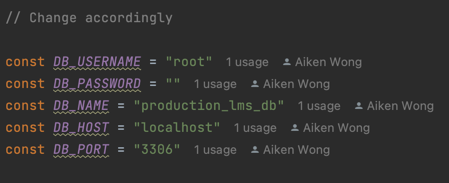
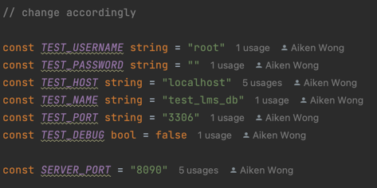
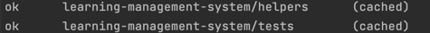

# About Golang-LMS-API
- This project implements the API endpoints as described in 
[this assignment](https://docs.google.com/document/d/1GIAcPG28lCF-D4LuQjM694fVpFHyBL1Q/edit)
- Other APIs for testing have been created for ease of testing, such as the population of 
students and teachers as well as an API to clear all tables in the database

## Hosted link
- An online instance of the server is hosted at [this link](http://18.183.14.140:8080)

## Implemented API endpoints:

1. Endpoint: DELETE /api/clear

   Headers: None

   Success response status: HTTP 204


2. Endpoint: POST /api/populateteachers

   Headers: Content-Type: application/json

   Success response status: HTTP 204

   Request body example:

   ```json
   {"students": ["student1@gmail.com","student2@gmail.com", "student3@gmail.com"]}
   ```

3. Endpoint: POST /api/populatestudents

   Headers: Content-Type: application/json

   Success response status: HTTP 204

   Request body example:

   ```json
   {"teachers": ["teacher1@gmail.com", "teacher2@gmail.com"]}
   ```

2. Endpoint: POST /api/register

   Headers: Content-Type: application/json

   Success response status: HTTP 204
   
   Request body example:

   ```json
   {"teacher": "teacher1@gmail.com","students": ["student1@gmail.com","student2@gmail.com"]}
   ```

3. Endpoint: GET /api/commonstudents
   
   Success response status: HTTP 200

   Request example: GET /api/commonstudents?teacher=teacher1%40gmail.com
      
   Success response body example:

      ```json
   {"students": ["student1@gmail.com","student2@gmail.com"]}
   ```
        
4. Endpoint: POST /api/suspend
   
   Headers: Content-Type: application/json

   Success response status: HTTP 204

   Request body example:
      ```json
   {"student": ["student1@gmail.com"]}
   ```
   
4. Endpoint: POST /api/retrievefornotifications
   
   Headers: Content-Type: application/json
   
   Success response status: HTTP 200

   Request body example:
   ```json
   {"teacher": "teacher1@gmail.com","notification":  "Hello students @student3@gmail.com"}
   ```
   Success response body example:
   ```json
   {"students": ["student2@gmail.com","student3@gmail.com, "]}
   ```
## Error Messages:
Invalid requests will result in a code 400 response and can be attributed to 5 types of errors:
1. Field not provided error. Occurs when a required field for the request is not provided
   ```json
   {"message":"The required field students is not supplied"}
   ```

2. Wrong field type error. Occurs when the wrong JSON type is provided for a required field
   ```json
   {"message":"The field students must be a []string"}
   ```
3. Does/do not exist error. Occurs when the entry to a provided field does not exist in the database:
   
   example 1:
   ```json
    {"message":"Teacher with email aiken@gmail.com does not exist in the database"}
   ```
   example 2:
   ```json
   {"message":"Students with emails test1@gmail.com, test2@gmail.com do not exist in the database"}
   ```
4. Invalid email address. Occurs when a provided email address is invalid:
   e.g.
   ```json
   {"message":"The email address aikenatgmail.com has an invalid format"}
   ``` 
5. Invalid content type header. Occurs when provided header for content type is not application/json for POST requests
   ```json
   "message":"Content-Type header must be application/json"}
   ```

## Design Patterns:

I have tried to adhere to good principles of software design by following the below patterns

### Facade Pattern:
There controller of the server (located at controllers/controller.go) act as the facade for incoming API requests.
It first validates the requests and then executes the appropriate transaction to handle the request and return the result.
By separating the validation logic from query logic in query transactions, we can achieve Single Responsibility Principle (SRP).

### Repository Pattern:
I have implemented repositories for the register_relationships, students and teacher tables in the database. These repositories 
implement unit of work methods that can be used by different transactions to perform more complicated queries. 
By composing complex transactions from unit of work functions, we can abide by the Don't Repeat Yourself (DRY) principle, where we do not repeat database (e.g. mysql) specific
queries or syntax across different implemented transactions. Furthermore, we can achieve SRP since queries in repositories perform only
singular functions, while each repository is only responsible for one type of query.

## Hosting on Localhost:
1. To host the application locally, we first need to create a database called "production-lms-db" on the local mysql server, alternatively, you may set the 
default DB_NAME for the application to whatever database name you wish and then create that database locally in my-sql.

   mysql command:
   
   ```mysql
   CREATE DATABASE production_lms_db;
   ```
2. The default username and password for the mysql server for this application is set to "root" and "" respectively, so a change
in user or password is required either on the mysql server
3. Alternatively, you may change the configuration in the `db.go` file so that the application may connect with any user or database 
in your own local mysql server.

   

3. You can then start the application normally using the command on the command line in the project's root directory:
   ```
   go run main.go
   ```
   Gorm will then handle the migration of the databases to ensure that it is structured properly
4. Alternatively, you may start the server using an IDE like JetBrains GoLand
5. The application will then run on localhost port 8080

## Testing
1. In order to test the application via the implemented tests, create a database in mysql called "test_lms_db" in mysql
   mysql command:

   ```mysql
   CREATE DATABASE test_lms_db;
   ```
2. Then change the password and user configurations on `tests/test_helpers.go`:

   

3. Then run the following in command line in the project's root directory to run all tests:
   ```
   go test ./...
   ```
4. Output:

   

5. Alternatively, the tests can be run on an IDE such as golang